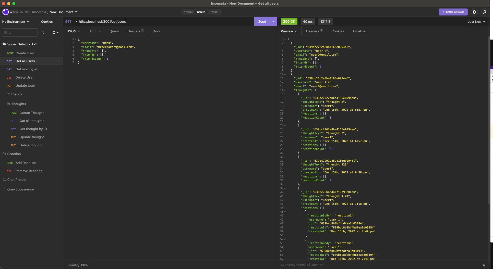

# SoNet-NoSQL

NoSQL: Social Network API
So = Social Network
Net = Network
I love puns. I tried something silly in naming this project. At the very least, I hope it amuses you.


## Table of Contents

- [Description](#description)
- [Technologies](#technologies)
- [Installation](#installation)
- [Usage](#usage)
- [License](#license)
- [Questions](#questions)

## Description

This is a NoSQL API for a social network web application where users can share their thoughts, react to friends’ thoughts, and create a friend list. This application uses Express.js for routing, a MongoDB database, and the Mongoose ODM.

## Technologies

- JavaScript
- Node.js
- Express.js
- MongoDB
- Mongoose

## Installation

To install the necessary dependencies, run the following command:

```
npm i
```

## Usage

To start the server, run the following command:

```
npm start
```

### Walkthrough Video

[Click Here to see the Demo video!](https://youtu.be/mRWXx4T89tU)



## License

<!-- Generate MIT shield -->


This project is licensed under the MIT license.

## Questions

If you have any questions about the repo, open an issue or contact me directly at [LinkedIn](https://www.linkedin.com/in/mdek). You can find more of my work at [GitHub:mrdekraker](https://github.com/mrdekraker?tab=repositories)
